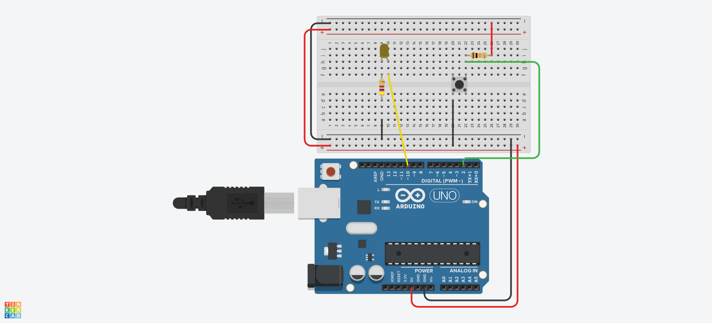

import LabTable from '@site/src/components/LabTable';

## Projeto final

O Projeto final tem os seguintes critérios de avaliação (Percentagem da nota):

1) Conter pelo menos um dispositivo de entrada (Teclado, botão, sensor...) (10%);
2) Conter pelo menos um CI com função lógica digital (Portas lógicas, Flip-Flop, Codificador, Mux...) (10%);
3) Conter pelo menos uma saída (LED, sete segmentos, LCD, Motor, Buzzer...) (10%);
4) Conter pelo menos um microcontrolador (Arduino, micro:bit, ATtiny...) (20%);
5) Possir simulação (Tinkercad, Proteus, Micro-Cap, PSIM, LTspice...) (20%);
6) Mostrar funcionando em bancada e fazer um video explicativo (30%);

**Data limite de entrega: 17/12/2025**

A partir dos requisitos a equipe tem liberdade para usar tantos componentes e técnicas quanto achar necessário. Não deixe de conferir o Livro Projeto Final, o qual aborda com detalhes esta atividade.

Project HUB: https://projecthub.arduino.cc/


## Template

### Descrição do Projeto

Aprenda a usar um botão e acender um LED usando Arduino.



#### Links
[TinkerCAD](https://www.tinkercad.com/things/8D2X1TflrKy/editel?sharecode=20K3g4wz07Z_4x3juZV1Vb9DiEr1QI_hnzYElNrlzfw)

[YouTube](https://youtu.be/CrHJj4OQ6Sw?si=79bG3Z-DqjfYXIxq)

### Código do Arduino

```c
void setup()
{
  pinMode(2, INPUT);
  pinMode(10, OUTPUT);
}

void loop()
{
  // Se o botão estiver apertado:
  if (digitalRead(2) == HIGH) {
    // Ligue o LED.
    digitalWrite(10, HIGH);
    // Caso contrário,
  } else {
    // Desligue o LED.
    digitalWrite(10, LOW);
  }
  delay(10); // Delay a little bit to improve simulation performance
}
```

### Lista de componentes

| Nome | Quantidade | Componente |
|---|---|---|
| U1 | 1 |  Arduino Uno R3 |
| R1 | 1 | 470 Ω Resistor |
| D2 | 1 | Amarelo LED |
| S1 | 1 |  Botão |
| R2 | 1 | 10 kΩ Resistor |

## HUB
- https://github.com/ruseleredu/ELT72B-Projetos
  